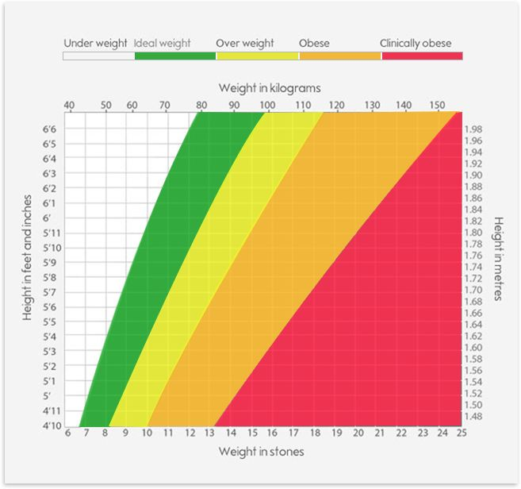
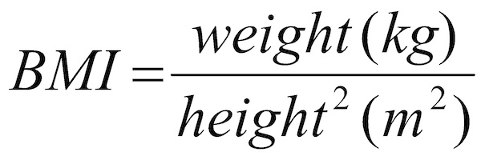

# Instructions

Write a program that interprets the Body Mass Index (BMI) based on a user's weight and height.

It should tell them the interpretation of their BMI based on the BMI value.
- Under 18.5 they are underweight
- Over 18.5 but below 25 they have a normal weight
- Equal to or over 25 but below 30 they are slightly overweight
- Equal to or over 30 but below 35 they are obese
- Equal to or over 35 they are clinically obese.

The BMI is calculated by dividing a person's weight (in kg) by the square of their height (in m):

`Important`:  you do not need to round the result to the nearest whole number. It's fine to print out a floating point number for this exercise. The interpretation message needs to include the words in bold from the interpretations above. e.g. underweight, normal weight, overweight, obese, clinically obese.

### Example Input 1
1.50\
63
### Example Output 1
Your BMI is 28.0, you are slightly overweight.
since 63 ÷ (1.50 x 1.50) = 28

The testing code will check for print output that is formatted like one of the lines below:

"Your BMI is 18.28678, you are underweight."
"Your BMI is 22.0, you have a normal weight."
"Your BMI is 28.50752, you are slightly overweight."
"Your BMI is 32.56189, you are obese."
"Your BMI is 37.50000, you are clinically obese."
### Example Input 2
1.60\
96
### Example Output 2
Your BMI is 37.49999999999999, you are clinically obese.
### Example Input 3
1.71\
73
### Example Output 3
Your BMI is 24.96494647925858, you have a normal weight.