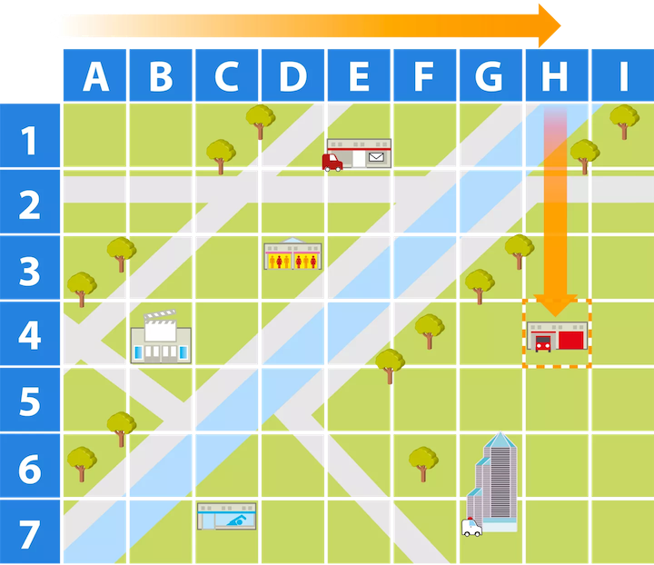
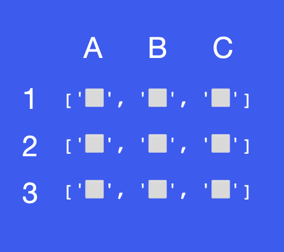
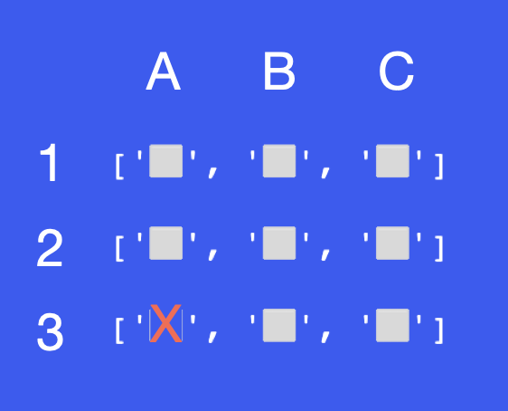

# Instructions

You are going to write a program that will mark a spot on a map with an X.

In the starting code, you will find a variable called map.

This map contains a nested list. When map is printed this is what it looks like, notice the nesting:

[['⬜️', '⬜️', '⬜️'],['⬜️', '⬜️', '⬜️'],['⬜️', '⬜️', '⬜️']]

This is a bit hard to work with. So on lines 6 and 23, we've used this line of code print(f"{row1}\n{row2}\n{row3}") to format the 3 lists to be printed as a 3 by 3 grid, each on a new line.

['⬜️', '⬜️', '⬜️']

['⬜️', '⬜️', '⬜️']

['⬜️', '⬜️', '⬜️']

Your job is to write a program that allows you to mark a square on the map using a letter-number system.

So an input of A3 should place an X at the position shown below:

First, your program must take the user input and convert it to a usable format.

Next, you need to use that input to update your nested list with an "X". Remember that your nested list map actually looks like this:

[['⬜️', '⬜️', '⬜️'],['⬜️', '⬜️', '⬜️'],['⬜️', '⬜️', '⬜️']]
### Example Input 1
B3
### Example Output 1
Hiding your treasure! X marks the spot.\
['⬜️', '️⬜️', '️⬜️']\
['⬜️', '⬜️', '️⬜️']\
['⬜️️', 'X', '⬜️️']
### Example Input 2
B1
### Example Output 2
Hiding your treasure! X marks the spot.\
['⬜️', 'X', '️⬜️']\
['⬜️', '⬜️', '️⬜️']\
['⬜️️', '⬜️️', '⬜️️']

## Hints
See if this List method helps you: https://www.w3schools.com/python/ref_list_index.asp

Remember that nested Lists in Python are accessed from outside to inside. e.g. In the List below:

list = [['A', 'B, 'C'], 'E', 'F', 'G']
