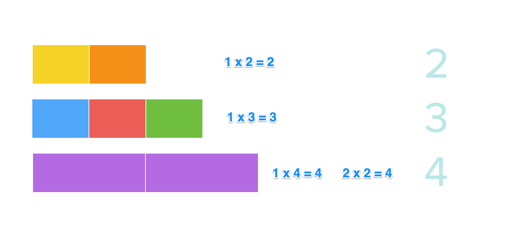
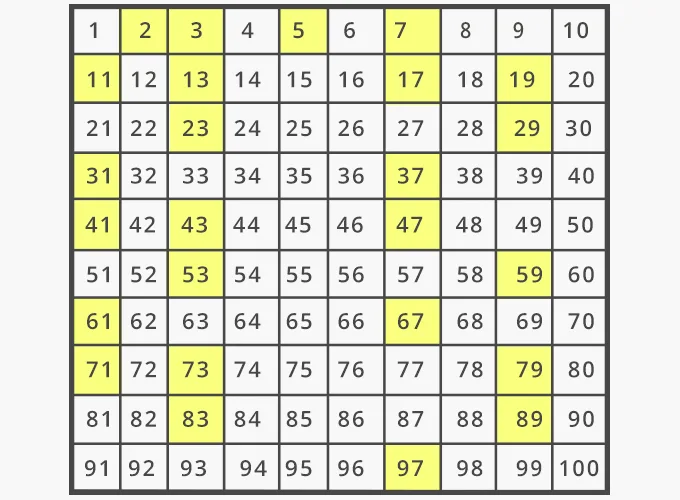

# Instructions

Prime numbers are numbers that can only be cleanly divided by themselves and 1.

You need to write a function that checks whether if the number passed into it is a prime number or not.

e.g. 2 is a prime number because it's only divisible by 1 and 2.

But 4 is not a prime number because you can divide it by 1, 2 or 4.

Here are the numbers up to 100, prime numbers are highlighted in yellow:

### Example Input 1
73
### Example Output 1
It's a prime number.
### Example Input 2
75
### Example Output 2
It's not a prime number.